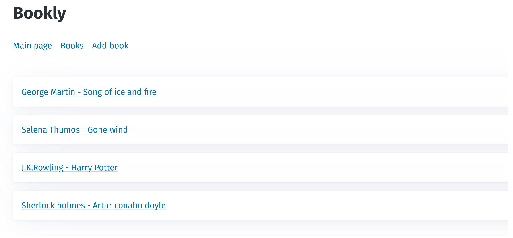

# Book tracker built with Go + HTMX + Templ

Simple book tracker using GoTH stack - [Go](https://go.dev/) + [Templ](https://github.com/a-h/templ) + [HTMX](https://htmx.org/)

## Description

This is my toy project to experiment with HTMX and Go web server combination. The website contains the list of books in sqlite database. I will keep updating by adding functionalities.



## Dependencies

* [Go](go.dev) 1.19 or later

* [Templ](github.com/a-h/templ)

* [Gin](github.com/gin-gonic/gin)

* [go-sqlite3](github.com/mattn/go-sqlite3)

## Installing

### Clone the repository
```bash
git clone https://github.com/gladuz/bookly-go.git
cd bookly-go
```
### Create database
```bash
make db
```
Creates empty database and table

### Running
```bash
make run
```
It will generate the template files and run the module after.
##